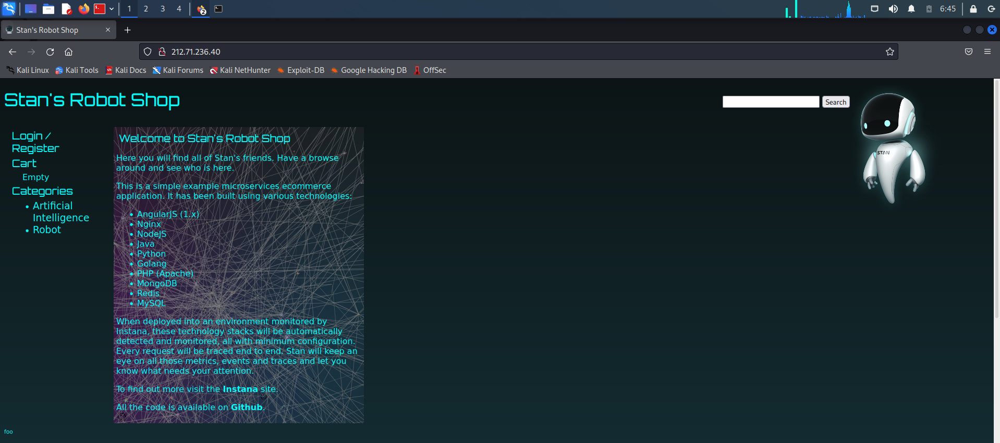
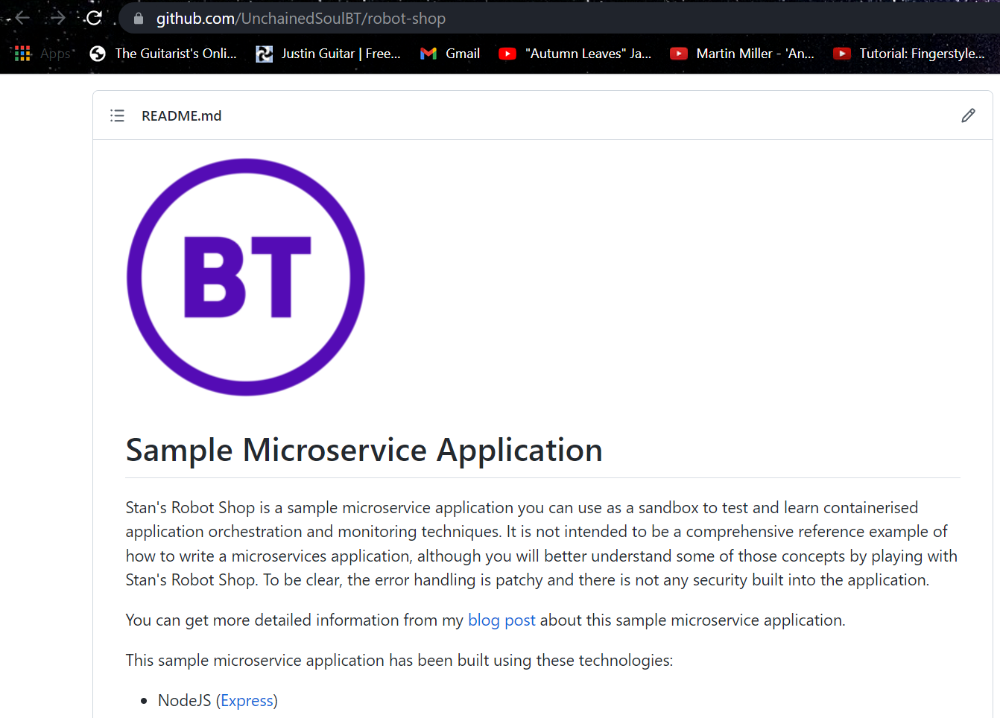

# BT's Instructions
verify installation of Helm & ISTIO
Check Helm Version ,Required for later(I'll use 3.8.0)
```shell
$ helm version
```

Install Stan's Robot Shop on the cluster using the helm chart 
```shell
$ cd helm
$ kubectl create ns robot-shop
$ helm install robot-shop --namespace robot-shop .
```
If you are using Helm V2.x then use
```shell
$ helm install --name robot-shop --namespace robot-shop .
```
apply the resource quatas
```shell
$ kubectl -n robot-shop apply -f resource-quota.yaml
```
Configure Istio ingress.
```shell
$ kubectl -n robot-shop apply -f Istio/gateway.yaml
```
Use the exposed Istio gateway to access.

```shell
$ kubectl -n istio-system get svc istio-ingressgateway
```
**Importent Suggestion**
use alias to shortcut the kubectl & Specific NS
```shell
$ alias kn=kubectl -n robot-shop
```
##Results





**Question**
Is there anything wrong with committing the file directly to the master
branch? How would you prevent that?

**Answer**
The master branch is deployable. It is your production code, ready to roll out into the world.
The master branch is meant to be stable, and it is the social contract of open source software to never push anything to master that is not tested, or that breaks the build. 
The entire reason GitHub works is that it is always safe to work from the master.
We can prevent that with the use of Protected Branch, We'll go to the Setting >> Branches and there we can add rules about who can Write/Modify/Remove and much more.


